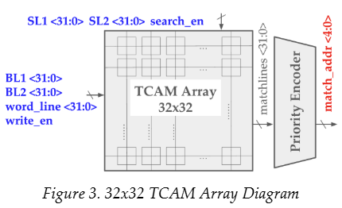
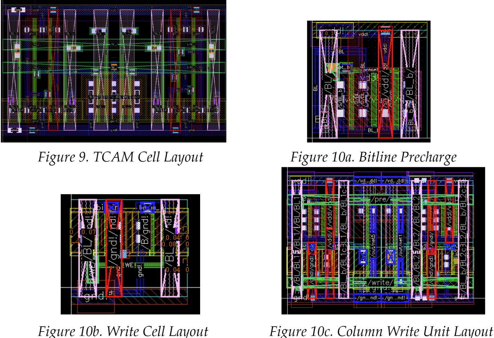
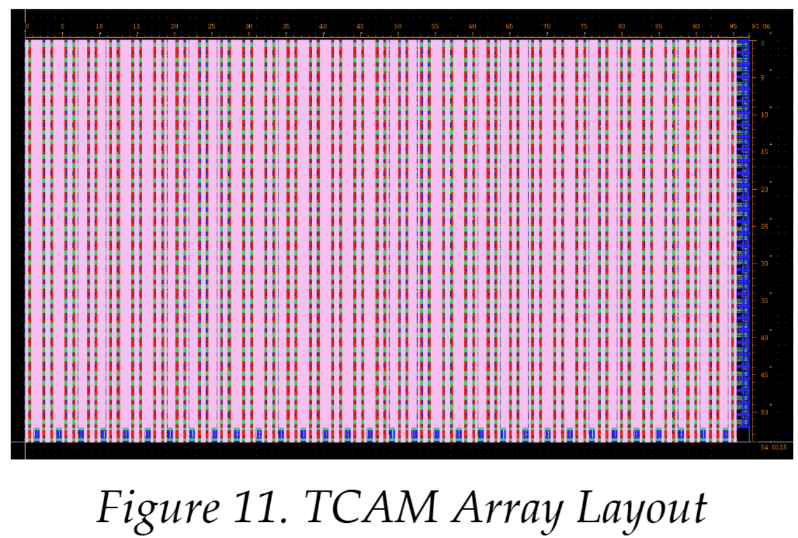
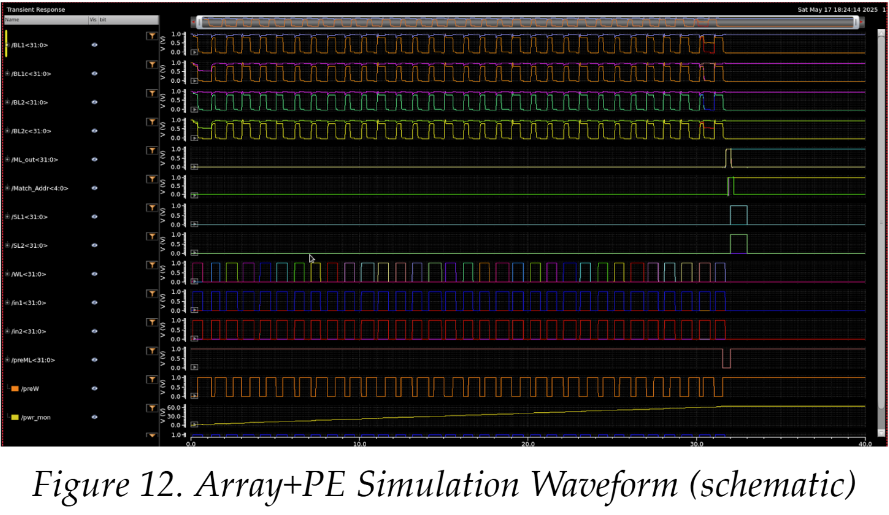

# VLSI 32x32 TCAM with Priority Encoder

This project implements a **32x32 Ternary Content-Addressable Memory (TCAM)** array integrated with a **5-bit highest-priority encoder**. Designed in a 180nm CMOS process, the system supports high-speed parallel search operations with ternary "don't care" support and optimized layout for speed, power, and area.

Developed as the final project for a VLSI design course at Cornell University.

---

## Features

- **32x32 TCAM Array** with ternary search (0, 1, X) support.
- **Parallel Search**: All 32 entries are compared in constant-time via matchlines.
- **Highest Priority Match**: A 32-to-5 priority encoder selects the highest-index matched row.
- **Write & Search Modes**:
  - Write: Wordline-selected row is programmed via BL1 and BL2.
  - Search: All matchlines precharged; mismatches pull down lines.
- **Schematic & Layout-Level Verification** using extracted post-layout parasitics.

---

## System Overview

- **Cell Design**: Each TCAM cell combines dual SRAM storage with an XOR-based pull-down network for search comparisons.
- **Row Architecture**: 32 TCAM cells form a row, sharing a matchline. Matchline precharged and evaluated using domino logic.
- **Priority Encoder**: Built from chained 8-to-3 encoders to compute the highest active matchline.
- **Top-Level**: Integrated Verilog-A testbench provides write/search control and stimulus.

---

## Performance

| Metric                         | Pre-Extraction | Post-Extraction |
|-------------------------------|----------------|-----------------|
| SL → ML Delay                 | 47.088 ps      | 69.037 ps       |
| SL → PE Delay                 | 201.093 ps     | 241.419 ps      |
| Total Power (32 writes + 1 search) | 64.639 pJ  | 70.349 pJ       |
| Average Write Power           | 1.98 pJ        | 2.155 pJ        |
| Search Power                  | 1.276 pJ       | 1.390 pJ        |
| Layout Area                   | —              | 97μm × 54μm     |

---

## Layout & Circuit Highlights

- **TCAM Cell Layout**: 2.98μm × 1.625μm using Metal 2/4 for vertical lines and Metal 3 for horizontals.
- **Write/Precharge Units**: Optimized for cell tiling; use scaled FETs for reliable drive strength.
- **Array**: Compact 32x32 layout with minimal wiring congestion; passes LVS and DRC.

---

## Verification

- Functional correctness of search/write validated with Verilog-A waveform simulation.
- Power and timing measurements extracted from post-layout simulations.
- Edge cases tested (e.g., one-bit mismatches, ternary cases).

